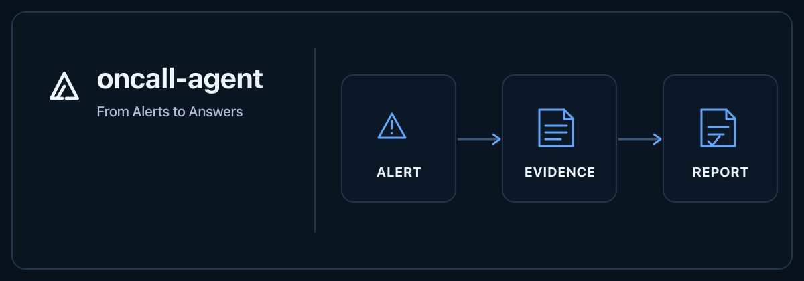
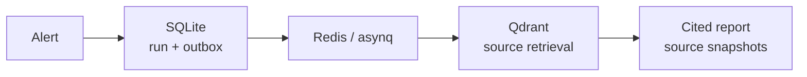

# oncall-agent

<p align="center">
  <a href="README.zh-CN.md">简体中文</a>
</p>

<p align="center">
  
</p>

<p align="center"><sub><a href="assets/readme/2026-10/oncall-agent-hero-en-static.svg">Static frame</a> · <a href="assets/readme/2026-10/oncall-agent-hero-en.svg">SVG source</a></sub></p>

<p align="center">
  
  
  
</p>

> A read-only evidence workspace for incident diagnosis. Follow an alert through durable run events and source retrieval to a report with citations responders can inspect.

> [!NOTE]
> M0–M2 are implemented. M3 global exploration is deferred.

## 🧭 From alert to evidence

`POST /alert` admits work, SQLite keeps business facts and the outbox, Redis/asynq runs the background job, and Qdrant retrieves source material. Each run retains its stage events and source snapshots for review.



## 🗂️ What you can inspect

| Area | What is visible | Boundary |
| --- | --- | --- |
| Incident runs | Evidence graph, source inspector, diagnosis report, and persisted stage timeline. | A `resolved` event updates lifecycle; it does not create another diagnosis or prove recovery. |
| Knowledge | Versioned documents, compare-and-swap updates, withdrawal, and immutable citation snapshots. | Auto-ingest is off by default. Reports and incident notes do not become qualified runbooks. |
| Topology and metrics (M2) | Source-backed topology and three restricted metric templates. | Missing samples stay `null`; impact is labeled inferred, and metrics are supporting observations rather than causal proof. |

> [!IMPORTANT]
> Alerts and tools are read-only. The agent does not acknowledge, silence, or remediate alerts. When relevant evidence is missing, it returns a safe no-evidence result.

## 🚀 Quick start

You need Go 1.25+, a C compiler for SQLite CGO, Node 24 to build the UI, Docker Compose services, and a reachable embedding endpoint. The template selects Ollama `nomic-embed-text`; chat and judge additionally use the configured OpenAI-compatible model.

```sh
# Keep an existing config and .env file.
cp -n config/config_template.json config/config.json
cp -n .env.example .env
(cd web/app && npm ci && npm run build)
docker compose up -d

# Generate two distinct credentials for this local run.
export ONCALL_CONSOLE_TOKEN="$(openssl rand -hex 32)"
export ONCALL_WEBHOOK_TOKEN="$(openssl rand -hex 32)"
export ONCALL_LOCALHOST_HTTP=true # loopback HTTP development only
export ONCALL_CONFIG="$PWD/config/config.json"
go run ./cmd/server
```

In another terminal, `curl -fsS http://127.0.0.1:8819/ready` checks the facts store, queue, and retrieval dependency. Open [http://127.0.0.1:8819](http://127.0.0.1:8819) and enter `ONCALL_CONSOLE_TOKEN`; the console creates a short same-origin `HttpOnly` / `SameSite=Strict` session. Omit `ONCALL_LOCALHOST_HTTP` when using TLS.

## 🔌 Interfaces

| Route | Purpose | Access |
| --- | --- | --- |
| `POST /alert` | Admit an alert asynchronously and return `202`. | Webhook token |
| `/api/v1/incidents`, `/runs/{id}`, `/incidents/{id}/graph` | Inspect incidents, run events, and the evidence graph. | Console token or session |
| `/api/v1/documents`, `/documents/{id}/versions`, `/api/v1/evidence/{id}` | Manage versioned knowledge and inspect cited sources. | Console token or session |
| `/mcp`, `/metrics` | Read-only MCP tools and Prometheus scrape endpoint. | Authenticated |

The legacy `/reports`, `/plan`, `/upload`, and `/chat` routes adapt the same domain facts. Production serves the built React app from Go; it does not run Node or Vite.

## 🧰 Operations and recovery

SQLite is the single-instance business fact store. Use `workspacectl inventory` and `dry-run` before migration; `backup --output` uses `VACUUM INTO` and refuses to overwrite. Stop the server before restoring, keep the original database, and never copy only the main file of an active WAL database. A different embedding space needs a new Qdrant collection; the application does not automatically delete old collections.

See the [operations guide](docs/execution/evidence-workspace/operations.md) for migration, backup, and rollback steps.

## 🧪 Verification and limits

The [verification record](docs/execution/evidence-workspace/verification.md) separates static checks, explicit fake-provider tests, external-service integration, and browser evidence. Go tests, race checks, vet, build, web typecheck/tests, browser flows, and the isolated container smoke are recorded there. Real-model quality (L4), multi-instance operation, and production throughput were not evaluated.

## 📚 Project documents

[API contract](docs/api/workspace.openapi.yaml) · [M0–M2 milestones](docs/execution/evidence-workspace/milestones.md) · [Roadmap](docs/ROADMAP.md)

[License: Apache-2.0](LICENSE)
