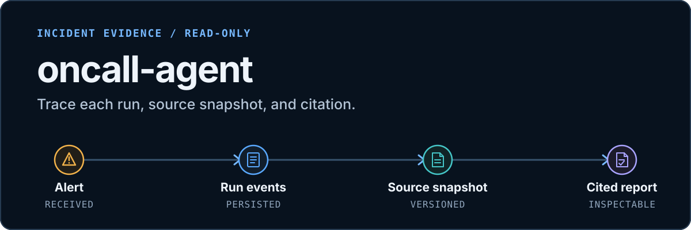
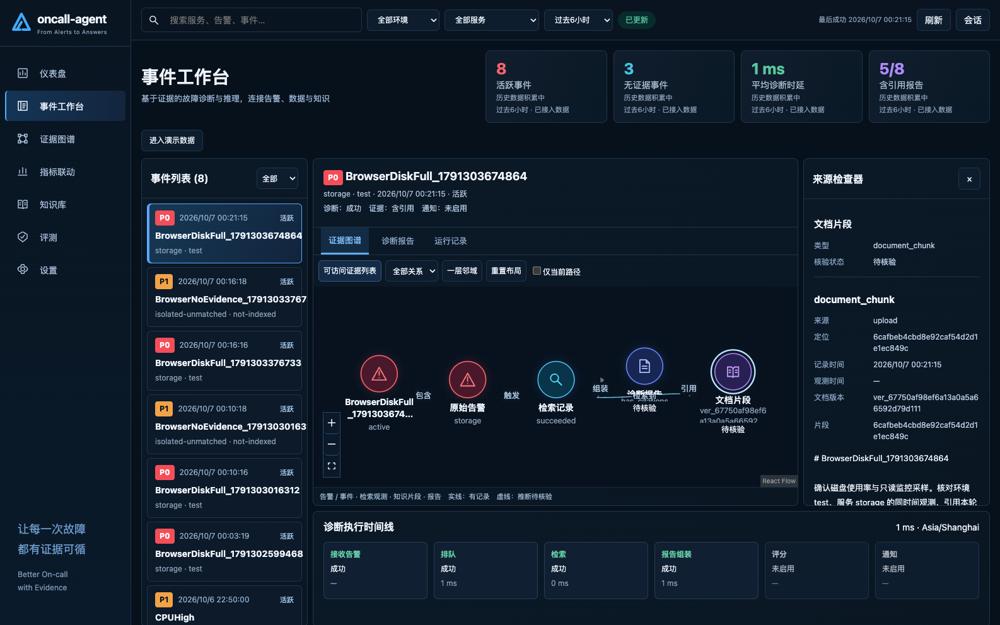

# oncall-agent

<p align="center"><a href="README.zh-CN.md">简体中文</a></p>

<p align="center">
  
</p>

<p align="center">
  
  
  
</p>

> A read-only evidence workspace for incident diagnosis. Follow an alert through persisted run events and source snapshots to a report responders can inspect.

> **Status:** M0–M2 are implemented. M3 global exploration is deferred.

## A run, with its evidence

<p align="center">
  <a href="docs/execution/evidence-workspace/m2/frontend/live/live-cited-inspector.png">
    
  </a>
</p>

<p align="center"><sub>Captured during the isolated L1 browser verification flow. Incident names and counts shown are test records, not production metrics or model-quality results. <a href="docs/execution/evidence-workspace/m2/frontend/verification.md">See the verification record.</a></sub></p>

## What stays inspectable

- **Incident runs:** ordered stage events, attempts, the evidence graph, and the resulting report. A `resolved` event updates lifecycle state; it does not launch another diagnosis or prove recovery.
- **Sources and citations:** versioned documents and immutable source snapshots let responders inspect what a report cited. Automatic ingestion is off by default; reports and incident notes do not become qualified runbooks.
- **Topology and metrics:** topology edges carry source references; three restricted Prometheus templates provide supporting observations. Missing samples stay `null`, and a metric does not establish cause.

> Alerts and agent tools are read-only. The system does not acknowledge, silence, or remediate alerts. When relevant evidence is missing, it returns a no-evidence result.

## How an alert moves

`POST /alert` records an incident run and outbox entry in SQLite. Redis/asynq runs the background job; Qdrant retrieves source material. The run keeps its stage events and source snapshots so the final cited report can be reviewed later.

## Quick start

You need Go 1.25+, a C compiler for SQLite CGO, Node 24 to build the UI, Docker Compose, a reachable embedding endpoint, and a configured OpenAI-compatible chat model. The config template uses Ollama `nomic-embed-text` for embeddings; set the chat model, API base, and key in `config/config.json` (or provide `OPENAI_API_KEY`).

```sh
cp -n config/config_template.json config/config.json
# Configure openai.model, openai.api_base, openai.api_key, and the embedding endpoint.
export ONCALL_CONFIG="$(pwd)/config/config.json"
export ONCALL_CONSOLE_TOKEN="$(openssl rand -hex 32)"
export ONCALL_WEBHOOK_TOKEN="$(openssl rand -hex 32)"
export ONCALL_LOCALHOST_HTTP=true # loopback HTTP development only; omit when using TLS

docker compose up -d redis qdrant prometheus
(cd web/app && npm ci && npm run build)
go run ./cmd/server
```

In another terminal, run `curl -fsS http://127.0.0.1:8819/ready` to check the facts store, queue, and retrieval dependency. Open [http://127.0.0.1:8819](http://127.0.0.1:8819) and enter `ONCALL_CONSOLE_TOKEN`; the console creates a short-lived same-origin session.

## Interfaces

- `POST /alert` accepts an alert for asynchronous diagnosis and returns `202`.
- `/api/v1` exposes incidents, runs, evidence graphs, versioned documents, and source snapshots.
- `/mcp` serves authenticated read-only tools; `/metrics` is the authenticated Prometheus scrape endpoint.
- Legacy `/reports`, `/plan`, `/upload`, and `/chat` routes adapt the same domain facts.

Production serves the built React app from Go; it does not run Node or Vite.

## Operations and verification

SQLite is a single-instance fact store. Use `workspacectl inventory` and `dry-run` before migration, and `backup --output` before recovery. Follow the [operations guide](docs/execution/evidence-workspace/operations.md); it covers migration, backup, and rollback.

The [verification record](docs/execution/evidence-workspace/verification.md) separates static checks, explicit fake-provider tests, external-service integration, and browser evidence. Real-model quality (L4), multi-instance operation, and production throughput were not evaluated.

## Project documents

[API contract](docs/api/workspace.openapi.yaml) · [M0–M2 milestones](docs/execution/evidence-workspace/milestones.md) · [Roadmap](docs/ROADMAP.md) · [Apache-2.0 license](LICENSE)
