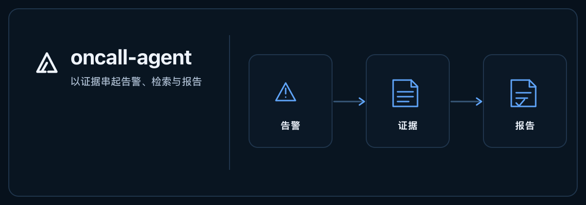
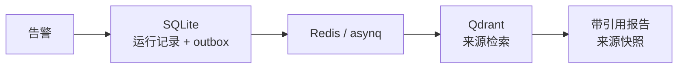

# oncall-agent（值班证据工作台）

<p align="center">
  <a href="README.md">English</a>
</p>

<p align="center">
  
</p>

<p align="center"><sub><a href="assets/readme/2026-10/oncall-agent-hero-zh-Hans-static.svg">静态帧</a> · <a href="assets/readme/2026-10/oncall-agent-hero-zh-Hans.svg">SVG 源图</a></sub></p>

<p align="center">
  
  
  
</p>

> 面向故障诊断的只读证据工作台：从告警、持久化运行事件和来源检索，一路追踪到可检查引用的报告。

> [!NOTE]
> M0–M2 已实现；M3 全局探索仍为 deferred。

## 🧭 从告警到证据

`POST /alert` 接收告警并异步入队，SQLite 保存业务事实与 outbox，Redis/asynq 执行后台任务，Qdrant 检索来源内容。每次运行都会保留阶段事件和来源快照，供后续检查。



## 🗂️ 工作台里可以检查什么

| 区域 | 可查看内容 | 边界 |
| --- | --- | --- |
| 事件运行 | 证据图、来源检查器、诊断报告和持久化阶段时间线。 | `resolved` 只更新事件生命周期，不会新建诊断，也不证明故障已恢复。 |
| 知识库 | 文档版本、compare-and-swap 更新、撤下，以及不可变引用快照。 | 默认关闭自动入库；报告和事件备注不会自动成为合格 runbook。 |
| 拓扑与指标（M2） | 有来源的拓扑，以及三个受限指标模板。 | 缺失样本保留为 `null`；影响标为 inferred，指标只是辅助观察，不构成因果证明。 |

> [!IMPORTANT]
> 告警和工具均为只读。Agent 不确认、不静默，也不自动处置告警。缺少相关证据时会返回安全的无证据结果。

## 🚀 快速启动

需要 Go 1.25+、SQLite CGO 所需的 C 编译器、用于构建前端的 Node 24、Docker Compose 服务，以及可访问的 Embedding 服务。模板选择 Ollama `nomic-embed-text`；聊天和 judge 还会使用配置的 OpenAI 兼容模型。

```sh
# 保留已有 config 和 .env，不覆盖。
cp -n config/config_template.json config/config.json
cp -n .env.example .env
(cd web/app && npm ci && npm run build)
docker compose up -d

# 为本地运行生成两个不同的凭据。
export ONCALL_CONSOLE_TOKEN="$(openssl rand -hex 32)"
export ONCALL_WEBHOOK_TOKEN="$(openssl rand -hex 32)"
export ONCALL_LOCALHOST_HTTP=true # 仅 loopback HTTP 开发模式
export ONCALL_CONFIG="$PWD/config/config.json"
go run ./cmd/server
```

在另一个终端运行 `curl -fsS http://127.0.0.1:8819/ready`，检查事实库、队列和检索依赖。打开[本地工作台](http://127.0.0.1:8819)，输入 `ONCALL_CONSOLE_TOKEN`；控制台会创建短期同源 `HttpOnly` / `SameSite=Strict` 会话。使用 TLS 时不要设置 `ONCALL_LOCALHOST_HTTP`。

## 🔌 接口

| 路由 | 用途 | 访问方式 |
| --- | --- | --- |
| `POST /alert` | 异步接收入队并返回 `202`。 | Webhook token |
| `/api/v1/incidents`、`/runs/{id}`、`/incidents/{id}/graph` | 查看事件、运行事件和证据图。 | Console token 或会话 |
| `/api/v1/documents`、`/documents/{id}/versions`、`/api/v1/evidence/{id}` | 管理版本化知识并检查引用来源。 | Console token 或会话 |
| `/mcp`、`/metrics` | 只读 MCP 工具和 Prometheus 抓取端点。 | 需要认证 |

兼容旧客户端的 `/reports`、`/plan`、`/upload` 和 `/chat` 仍适配同一领域事实。生产环境由 Go 托管构建后的 React 前端，不运行 Node 或 Vite。

## 🧰 运维与恢复

SQLite 是单实例业务事实来源。迁移前使用 `workspacectl inventory` 和 `dry-run`；`backup --output` 通过 `VACUUM INTO` 生成备份并拒绝覆盖。恢复前先停止服务、保留原数据库；活动 WAL 期间不能只复制主数据库文件。更换 Embedding 空间时应使用新的 Qdrant collection，应用不会自动删除旧 collection。

迁移、备份和回滚步骤见[运行手册](docs/execution/evidence-workspace/operations.md)。

## 🧪 验证与限制

[验收记录](docs/execution/evidence-workspace/verification.md)分别记录静态检查、显式 fake provider 测试、外部服务集成和浏览器证据。记录包含 Go 测试、race、vet、build、前端型检与测试、浏览器流程及隔离容器 smoke。真实模型质量（L4）、多实例运行和生产吞吐本次未评估。

## 📚 项目文档

[API 契约](docs/api/workspace.openapi.yaml) · [M0–M2 里程碑](docs/execution/evidence-workspace/milestones.md) · [路线图](docs/ROADMAP.md)

[许可证：Apache-2.0](LICENSE)
