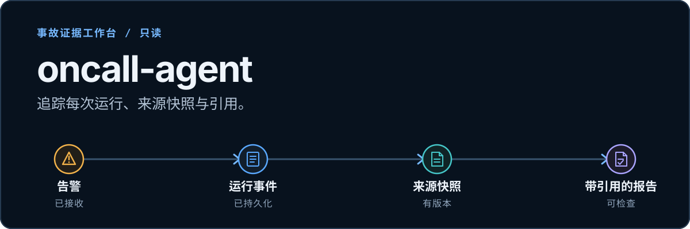

# oncall-agent｜值班事故证据工作台

<p align="center"><a href="README.md">English</a></p>

<p align="center">
  
</p>

<p align="center">
  
  
  
</p>

> 面向事故诊断的只读证据工作台：从告警追踪持久化运行事件和来源快照，最终得到可检查引用的报告。

> **状态：** M0–M2 已实现；M3 全局探索暂缓。

## 一次运行，连同它的证据

<p align="center">
  <a href="docs/execution/evidence-workspace/m2/frontend/live/live-cited-inspector.png">
    
  </a>
</p>

<p align="center"><sub>截图来自隔离的 L1 浏览器验收流程。告警名称和计数是测试记录，不代表生产指标或模型质量结果。<a href="docs/execution/evidence-workspace/m2/frontend/verification.md">查看验证记录。</a></sub></p>

## 可以检查什么

- **事故运行：** 按序保存的阶段事件、执行尝试、证据图和诊断报告。`resolved` 事件只更新生命周期状态，不会启动新诊断，也不证明故障已恢复。
- **来源与引用：** 文档版本和不可变来源快照让响应人员可以检查报告引用的内容。自动入库默认关闭；报告和事件备注不会自动成为合格 runbook。
- **拓扑与指标：** 拓扑边带有来源引用；三个受限 Prometheus 模板提供辅助观察。缺失样本保留为 `null`，指标不能证明因果关系。

> 告警处理和 Agent 工具均为只读。系统不会确认、静默或处置告警。缺少相关证据时会返回无证据结果。

## 告警如何流转

`POST /alert` 在 SQLite 中记录事故运行和 outbox 条目。Redis/asynq 执行后台任务，Qdrant 检索来源内容。运行会保留阶段事件和来源快照，供后续检查带引用的报告。

## 快速启动

需要 Go 1.25+、SQLite CGO 所需的 C 编译器、用于构建前端的 Node 24、Docker Compose、可访问的 Embedding 服务，以及配置好的 OpenAI 兼容聊天模型。配置模板使用 Ollama `nomic-embed-text` 做 Embedding；请在 `config/config.json` 中设置聊天模型、API 地址和 Key（也可通过 `OPENAI_API_KEY` 提供）。

```sh
cp -n config/config_template.json config/config.json
# 配置 openai.model、openai.api_base、openai.api_key 和 Embedding 服务地址。
export ONCALL_CONFIG="$(pwd)/config/config.json"
export ONCALL_CONSOLE_TOKEN="$(openssl rand -hex 32)"
export ONCALL_WEBHOOK_TOKEN="$(openssl rand -hex 32)"
export ONCALL_LOCALHOST_HTTP=true # 仅 loopback HTTP 开发模式；TLS 环境不要设置

docker compose up -d redis qdrant prometheus
(cd web/app && npm ci && npm run build)
go run ./cmd/server
```

在另一个终端运行 `curl -fsS http://127.0.0.1:8819/ready`，检查事实库、队列和检索依赖。打开[本地工作台](http://127.0.0.1:8819)，输入 `ONCALL_CONSOLE_TOKEN`；控制台会创建短期同源会话。

## 接口

- `POST /alert` 异步接收告警并返回 `202`。
- `/api/v1` 提供事故、运行、证据图、版本化文档和来源快照接口。
- `/mcp` 提供需认证的只读工具；`/metrics` 是需认证的 Prometheus 抓取端点。
- 旧版 `/reports`、`/plan`、`/upload` 和 `/chat` 路由会适配同一领域事实。

生产环境由 Go 托管构建后的 React 前端，不运行 Node 或 Vite。

## 运维与验证

SQLite 是单实例事实来源。迁移前运行 `workspacectl inventory` 和 `dry-run`，恢复前先使用 `backup --output` 备份。[运行手册](docs/execution/evidence-workspace/operations.md)包含迁移、备份与回滚步骤。

[验证记录](docs/execution/evidence-workspace/verification.md)分别记录静态检查、显式 fake provider 测试、外部服务集成和浏览器证据。真实模型质量（L4）、多实例运行和生产吞吐尚未评估。

## 项目文档

[API 契约](docs/api/workspace.openapi.yaml) · [M0–M2 里程碑](docs/execution/evidence-workspace/milestones.md) · [路线图](docs/ROADMAP.md) · [Apache-2.0 许可证](LICENSE)
